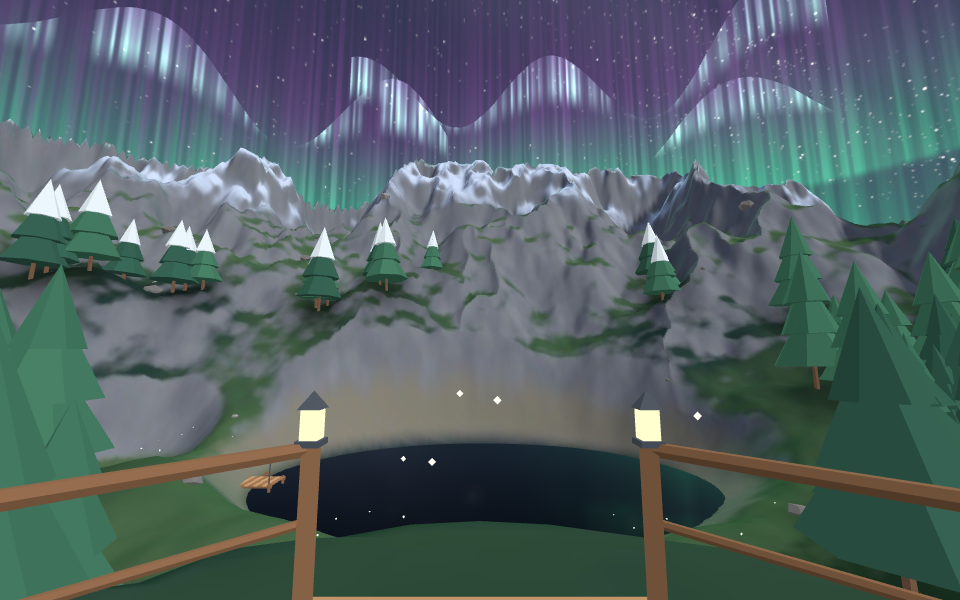
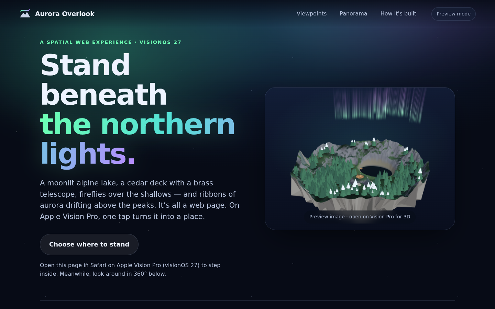
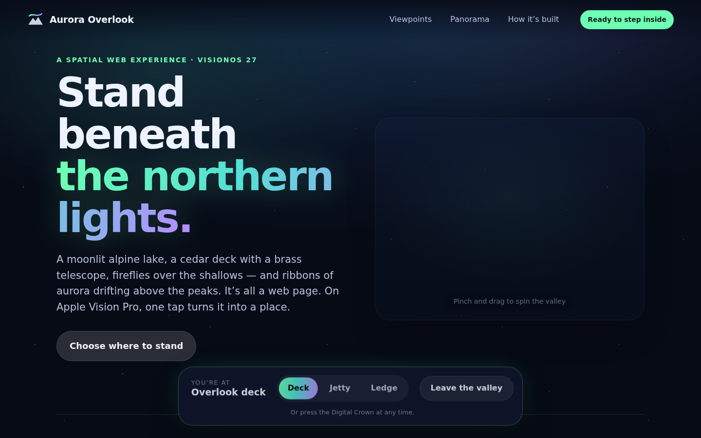
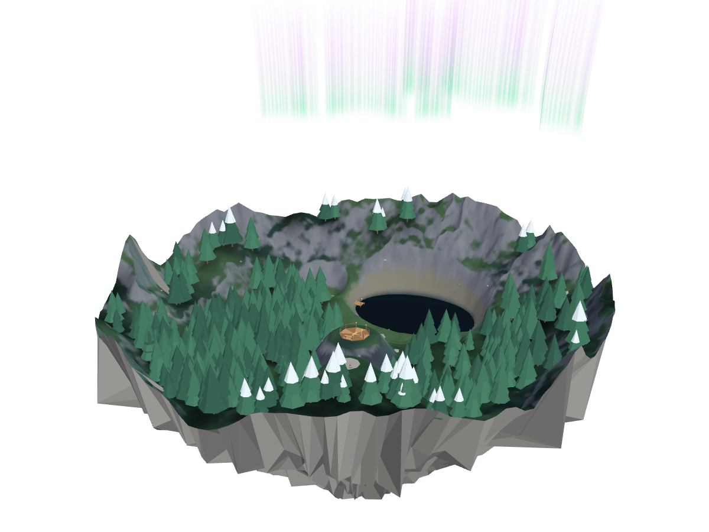
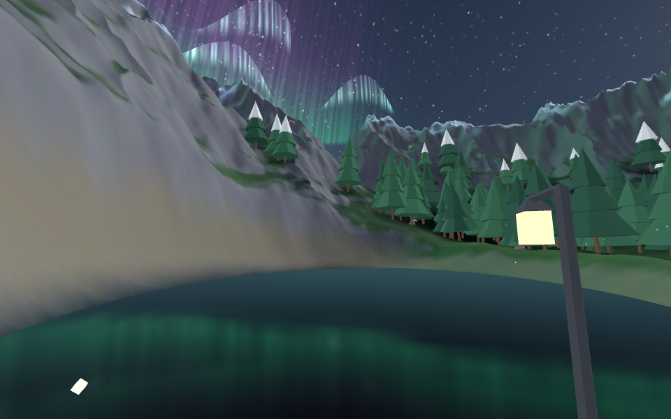
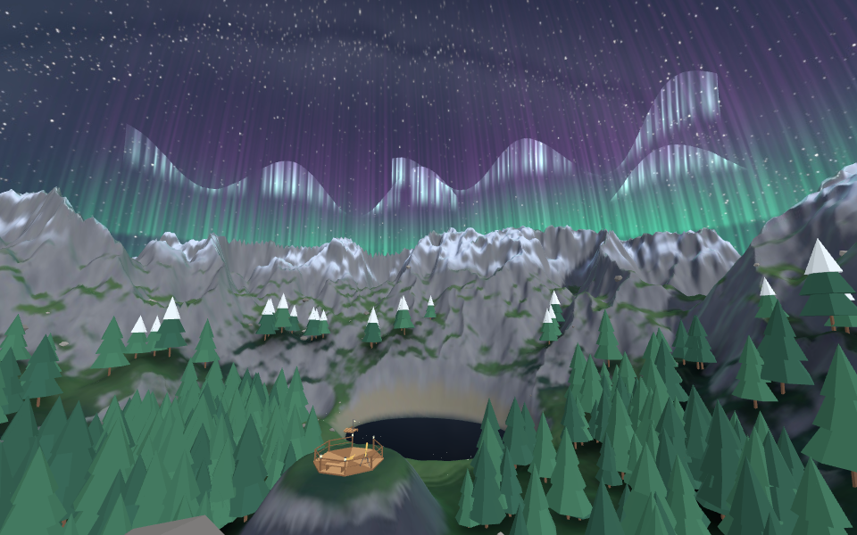

# Aurora Overlook

A **spatial web experience** for Safari on Apple Vision Pro (visionOS 27). It's
a normal web page. Tap **Step inside** and Safari surrounds you with a moonlit
alpine valley: a lake, a pine forest, a cedar deck with a brass telescope,
fireflies, and aurora curtains drifting over the peaks. The page stays floating
in front of you as a control panel.



| Page | While you're inside | Inline 3D diorama |
| --- | --- | --- |
|  |  |  |

| Lantern jetty | Summit ledge |
| --- | --- |
|  |  |

## What visionOS 27 features it uses

| Feature | Where |
| --- | --- |
| **Immersive website environments**: `model.requestImmersive()`, `document.exitImmersive()`, `document.immersiveEnabled`, `document.immersiveElement`, the `immersivechange`/`immersiveerror` events | `site/app.js` |
| **`entityTransform`** (a `DOMMatrix`) moves you between three standing spots (deck, jetty, ledge) and turns the view 30° away from the Safari window | `transformFor()` in `site/app.js` |
| **Inline `<model>`** with `stagemode="orbit"`: a 36 cm floating-island diorama you can pinch and spin | `site/index.html` |
| **`environmentmap`**: a 360° HDR (EXR) lighting map, so the water and brass reflect the aurora sky | `site/assets/overlook-light.exr` |
| **USD animation** with `autoplay loop`: the aurora curtains drift and the fireflies bob on a 30-second loop | `tools/build_assets.py` |
| **``**: a wide panorama you can wrap around yourself | Panorama section |
| **Graceful fallback**: other browsers get posters and a drag-to-look WebGL 360° viewer | `site/pano360.js` |

The world model has `display: none`, so the 5 MB environment only downloads
when someone actually steps inside.

## Run it on your headset

From the repo root:

```sh
python3 scripts/serve.py
```

Then open `http://<your-computer-ip>:8000/aurora-overlook/` in Safari on the
Vision Pro. Or use the GitHub Pages link (see the root README):
`https://eeyorenn.github.io/VisionPro/aurora-overlook/`.

If you host it somewhere else, serve `.usdz` as `model/vnd.usdz+zip` and `.exr`
as `image/aces`.

## Rebuild or remix the world

Everything in the valley is procedural: terrain, forest, sky, aurora, deck, even
the moon. No Blender required.

```sh
cd projects/aurora-overlook
python3 -m venv .venv && .venv/bin/pip install -r tools/requirements.txt
.venv/bin/python tools/build_assets.py        # ~2 min → site/assets/*.usdz, .exr, viewpoints.json

# optional: re-render the preview images (three.js in headless Chromium)
cd tools/render && npm install && node render.mjs
```

At the end, `build_assets.py` runs all 28 of USD's built-in validators on each
USDZ. It also writes the USDZ packages itself (uncompressed, 64-byte aligned,
textures under `textures/`) so the output is predictable. Knobs worth playing with:

- `AURORA_SPECS` and `aurora_curtain()`: the shape and colours of the northern lights
- `natural_height()`: mountains, the ridge, the valley depth (`VALLEY_DROP`)
- `MOON_AZ` / `MOON_EL`: where the moon sits and where shadows fall
- the `viewpoints` list at the bottom of the file: add your own standing spots

Scene conventions (from Apple's immersive `<model>` rules): 1 unit = 1 meter, Y up,
origin at the visitor's feet, and −Z is straight ahead (north in this valley).
Lighting is baked into emissive textures, so the scene renders cheaply.

## Caveats

- This was built without a headset. The layout, the USDZ files and the
  enter/switch/leave flow were tested in desktop Chromium, using a stand-in for
  Safari's immersive API and a three.js render of the USDZ files. Real-device
  tuning (brightness, aurora opacity, viewpoint headings) may still be needed.
- Switching viewpoints while inside exits and immediately re-enters, the same
  pattern as Apple's seat-preview demo. If Safari ever refuses the re-entry, the
  page tells you to tap "Step inside" again.
