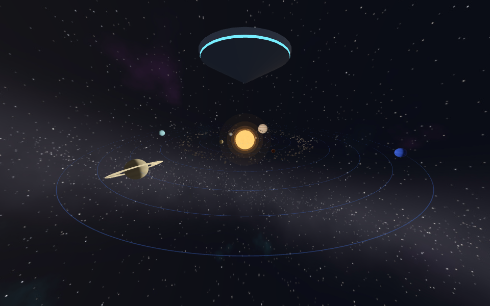
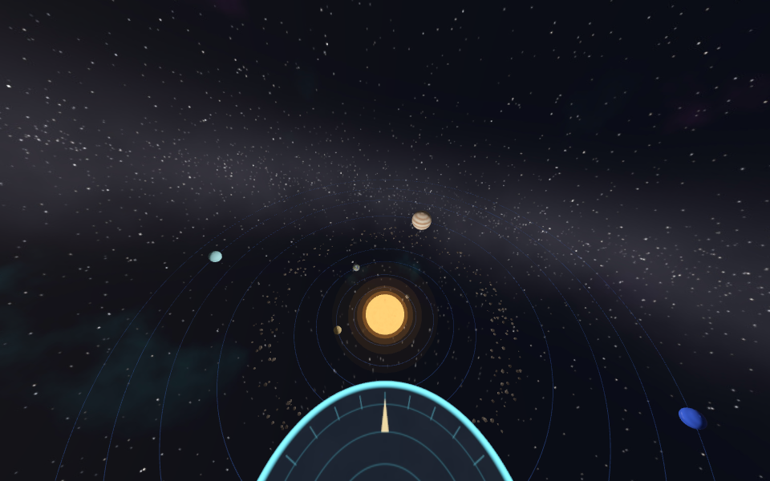
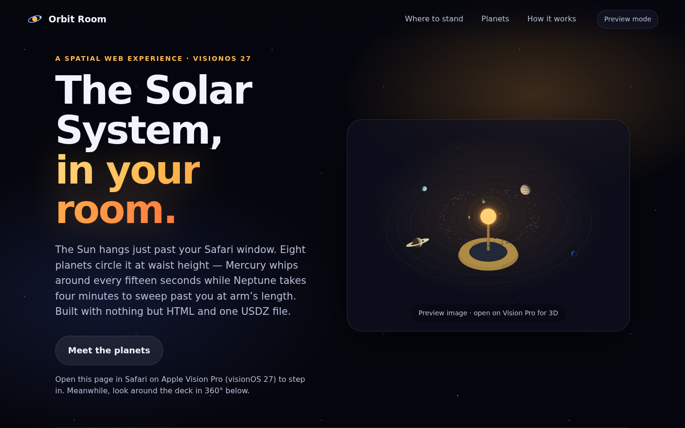
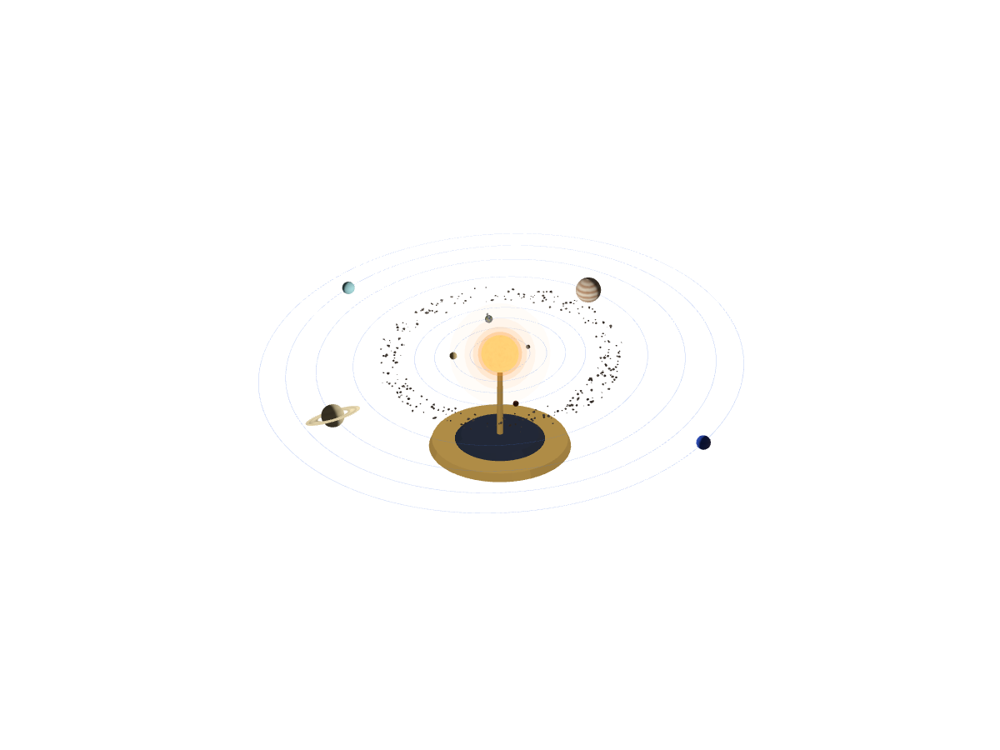

# Orbit Room

A room-scale Solar System for Safari on Apple Vision Pro (visionOS 27). Tap
**Step into orbit** and you're standing on a small floating deck. The Sun hangs
just past your Safari window and the eight planets orbit it at waist height:
Mercury laps every 12 seconds, and Uranus and Neptune take four minutes to sweep
around you at arm's length. The web page stays in front of you as a control
panel with play/pause and speed.



| Skywalk | Page | Inline orrery |
| --- | --- | --- |
|  |  |  |

**Live:** https://eeyorenn.github.io/VisionPro/orbit-room/

## What it uses

| Feature | How |
| --- | --- |
| Immersive website environment | `model.requestImmersive()` on a hidden `<model>` (shared helper: `shared/web/immersive.js`) |
| USD transform animation | Every planet sits in a spinning transform keyframed in the USDZ, with a whole number of laps per 4-minute loop so it repeats seamlessly. `autoplay loop` starts it |
| Animation control from the page | `model.play()`, `model.pause()` and `model.playbackRate` for the 1×, 4× and 12× buttons |
| Two viewpoints | `entityTransform` moves you between the observation deck and the skywalk above the orbits |
| Inline `<model stagemode="orbit">` | A 33 cm brass tabletop orrery you can spin on the page |
| `environmentmap` | An EXR of the Milky Way with a bright Sun, so the metal decks reflect them |

## Honest scale

Real distances won't fit in a room. Neptune orbits 30× farther out than Earth,
and Earth would be a speck next to the Sun. Here orbits are squeezed to between
0.45 m and 3.6 m and planets are enlarged, but the order, the colours and the
relative orbit speeds are kept (inner planets lap faster). Each planet keeps one
face toward the Sun so its baked day/night line always points the right way.
Earth's night side shows city lights.

## Rebuild

```sh
cd projects/orbit-room
python3 -m venv .venv && .venv/bin/pip install -r ../../shared/python/requirements.txt
.venv/bin/python tools/build_assets.py        # ~1 min: planets, rings, belt, sky, USDZ, EXR, JSON
cd ../../shared/render && npm install && node render.mjs ../../projects/orbit-room   # preview images
```

Knobs in `tools/build_assets.py`: `PLANETS` (orbit radius, size, laps per loop,
start angle), `SUN_CENTER`, `SYSTEM_TILT`, `LOOP_SECONDS`, and `planet_texture()`
for how each world is painted.

## Caveats

Built without a headset. The USDZ files pass USD's validators and render
correctly in three.js, and the page flow was tested with a stand-in for Safari's
API. Whether visionOS honours `playbackRate`/`pause()` on an immersive model
hasn't been confirmed on a device; if it doesn't, the buttons simply do nothing
and the planets keep orbiting at 1×.
