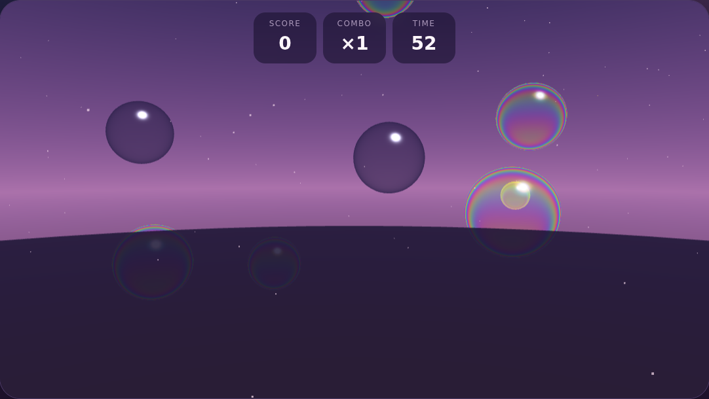
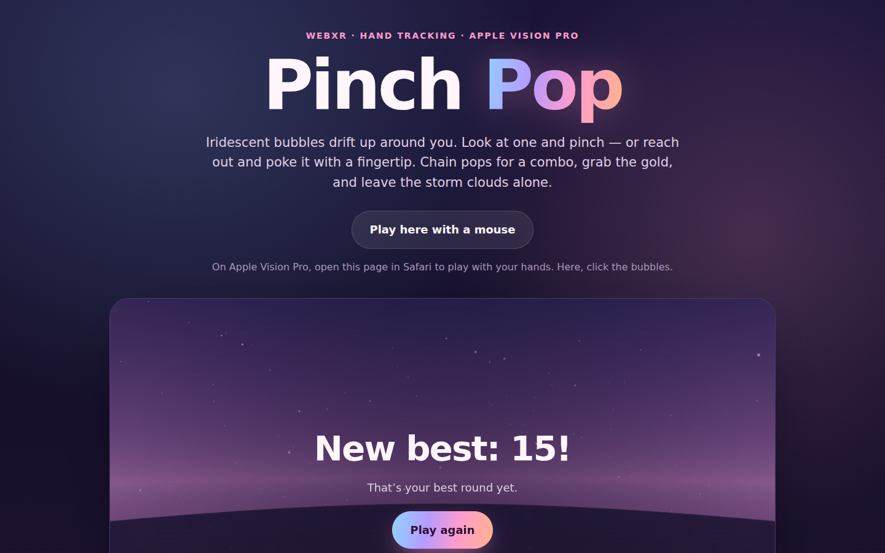
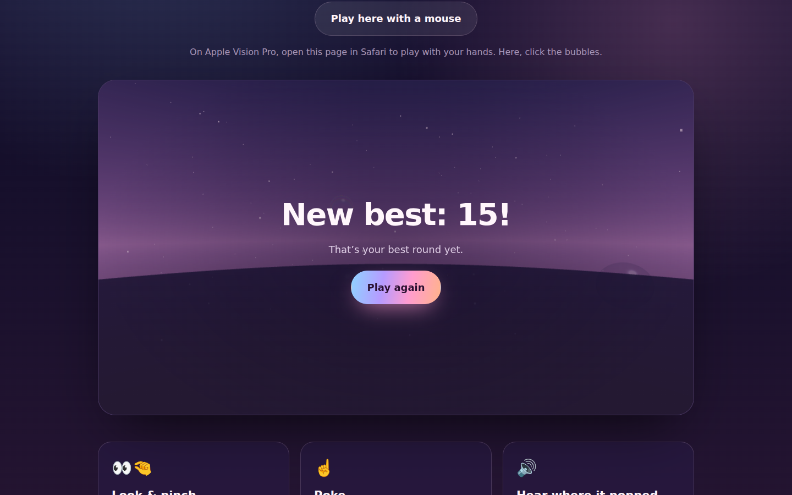

# Pinch Pop

A **WebXR hand-tracking game** for Apple Vision Pro. Iridescent soap bubbles
drift up around you, and you pop them by **looking at one and pinching** or by
**poking it with your fingertip**. Every pop is a tiny synthesized sound placed
exactly where the bubble was, and its pitch climbs as your combo builds.

| Page | Game over |
| --- | --- |
|  |  |

**Live:** https://eeyorenn.github.io/VisionPro/pinch-pop/. On Vision Pro, tap
**Play in Vision Pro**. Anywhere else, **Play here with a mouse**.

## Rules

- 60-second rounds.
- Blue bubbles are 1 point, **gold** (small, fast) are 5, and **storm clouds**
  cost 5 and break your combo.
- Pop within 1.4 s of the last pop to build a combo. The multiplier goes up
  every 3 pops, to a maximum of ×5.
- Your best score is kept on the device (`localStorage`).

## How it works

| Piece | Where |
| --- | --- |
| WebXR session: `immersive-ar` (your real room) when Safari offers it, otherwise `immersive-vr` with a dusk sky; `local-floor` + optional `hand-tracking` | `PinchPop.enterXR()` in `site/game.js` |
| **Look + pinch**: visionOS delivers a gaze-aimed `transient-pointer` input on pinch. On `selectstart` the game reads its `targetRaySpace` pose and ray-casts the bubbles | `#onXRSelect()` |
| **Poke**: three.js hand joints; each frame tests both `index-finger-tip` joints against every bubble | `#tick()` |
| Soap-film shader: fresnel rim + thin-film interference colours that swirl over time | `bubbleMaterial()` |
| Spatial audio: Web Audio noise burst + sine blip through an HRTF `PannerNode` at the bubble; the listener follows your head | `class Sound` |
| Score panel in 3D: a canvas texture that lazily follows your gaze | `class Panel` |

three.js loads from jsDelivr via an import map. There's no build step: edit and reload.

## Caveats

Built without a headset. The mouse version was played end to end in headless
Chromium, but the WebXR paths (gaze-pinch ray, fingertip pokes, AR vs VR choice)
haven't been run on a Vision Pro yet. If something feels off, like bubbles too
close or pinches missing, the tuning constants are at the top of `game.js`.
